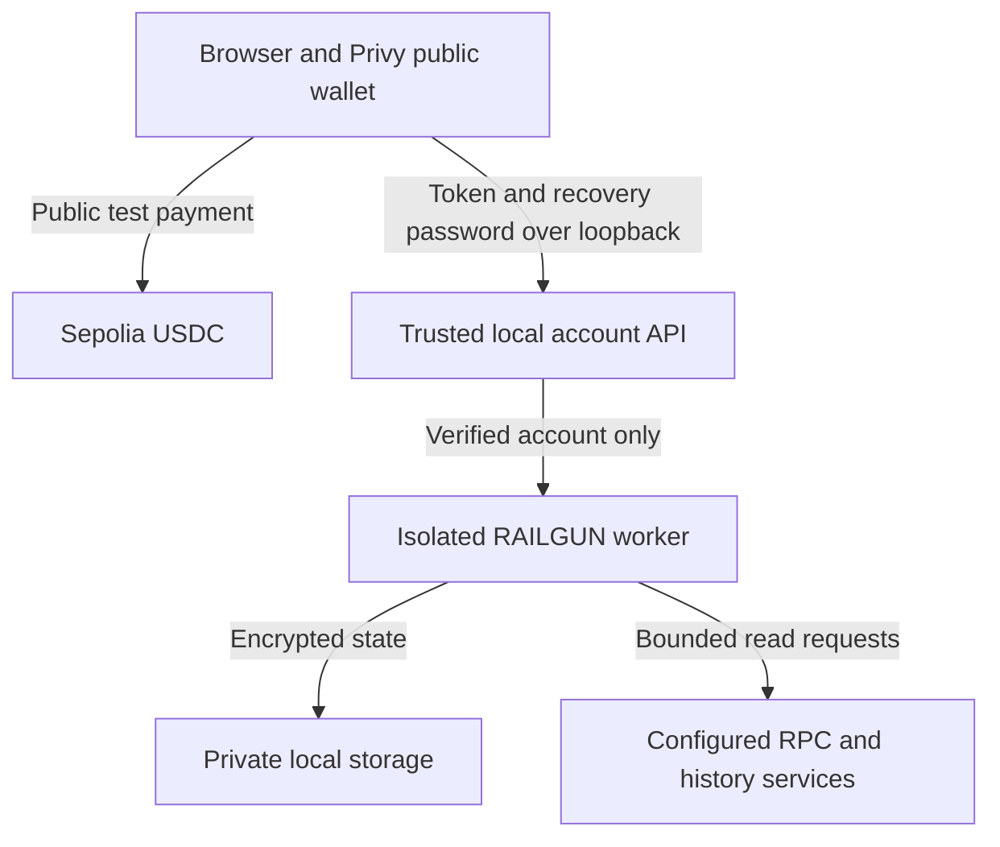

# Honeybee Pay security review checkpoint

September 11, 2026. This is an implementation review and test record, not an
independent audit, production approval, or proof of private-payment settlement.

## Current trust boundaries

The local machine and runtime are trusted with decrypted wallet material while
the worker runs. Email authentication selects an account; it is not a backup
decryption key. Account-bound access, isolated workers, restricted local files,
bounded uploads and fixed error messages reduce exposure but do not defend
against a compromised host. Do not host this private runtime or place it behind
a public tunnel without a different reviewed custody/transport design.

## Segment 1Z changes

RPC and GraphQL history replies now have an 8 MiB decoded-byte limit; POI replies
have a 1 MiB limit. Readers count streamed bytes, cancel oversized bodies, honor
abort/deadline signals and retain a single bounded growing buffer even for tiny
chunks. Untrusted Content-Length is not the only check. The actual Axios POI
fetch hook uses the same reader. The direct read-only RPC helper does not retry
size-limit failures. Existing endpoint selection and write restrictions remain.

These limits can reject a legitimate unusually large history batch; failure is
intentional and does not mark the wallet synchronized. Validate real scan sizes
before any tuning. The limits do not constitute a complete system-wide memory
budget and do not fix all transitive dependency advisories.

## Residual dependency findings

Segment 1Y's fresh production audits recorded 5 low private-runtime package
findings and 23 moderate checkout findings, with no high/critical findings.
Package versions and lockfiles are unchanged in 1Z; a new audit is not claimed.

| Dependency | Evidence reviewed | Remaining boundary |
| --- | --- | --- |
| elliptic via crypto-browserify | The installed wallet references crypto-browserify in its separate React Native shim. A Node SDK import did not load crypto-browserify, elliptic or that shim. | Import-cache inspection is not a proof about every future runtime path. Do not adopt the React Native shim or waive the signing/key risk. An upstream fix or carefully reviewed replacement is still required for affected usage. |
| uuid 8/9 in wallet connectors | Inspected MetaMask utilities use v4; the reported flaw concerns other UUID methods with output buffers. | No complete bundled-connector reachability proof. An upgrade across major versions needs actual connector integration validation. |
| decode-uri-component 0.2.2 | The maintainer identifies 0.5.0 as the fixed release. Between these lines, the package changes CommonJS to ESM and stops converting plus signs to spaces. | It cannot be treated as a safe drop-in pin for the existing CommonJS query-string consumer. Review an upstream connector upgrade or a separately tested compatibility adapter. |

Sources: [URI-decoder advisory](https://github.com/SamVerschueren/decode-uri-component/security/advisories/GHSA-vcc3-ghjq-m6fr),
[release changes](https://github.com/SamVerschueren/decode-uri-component/releases),
[uuid advisory](https://github.com/uuidjs/uuid/security/advisories/GHSA-w5hq-g745-h8pq),
and [elliptic upstream issue](https://github.com/indutny/elliptic/issues/321).
GraphQL Mesh peer mismatches and existing checkout build warnings remain open.

## Logs and evidence review

Reviewed first-party console/error sites, tracked environment-variable names,
and 22 tracked JSON evidence reports. The report scan found no nonempty values
under mnemonic, seed, privateKey, encryptionKey, password, accessToken,
refreshToken or authorization field names. Tracked environment files contain
public configuration keys; the production frontend file names only its public
Privy App ID. SDK account workers suppress stdout/stderr and return fixed errors.

This scoped scan is not a full Git-history secret scan or an entropy detector.
It does not certify third-party logs or screenshots. Review recordings before
sharing, and keep recovery exports and credentials outside Git and recordings.

## Controls and nonclaims

- The offline attack comparison invokes the actual application transfer adapter
  with SDK doubles. It checks recipient substitution, not a real prompt-injection
  exploit or onchain attack. No tokens move in that demo.
- A synthetic-input proof demonstrates prover compatibility and tamper rejection;
  it does not prove a funded account or paid invoice.
- Application checks cannot stop a compromised signer from using another path.
  The learning Solidity contract only records public approvals and is not wired
  into the checkout. A declared `used` field is not replay enforcement.
- Private receipt design must bind the original request, actual wallet note,
  token, amount, recipient, transaction and finality. Request-file digests do not
  authenticate a merchant, and private requests/history are not paid receipts.
- The private signing controller is disconnected and its gate stays closed.
  Merchant proof/submission/settlement and encrypted receipts need further work
  after the live wallet/deposit gates. KYC and commercial fees remain deferred.
